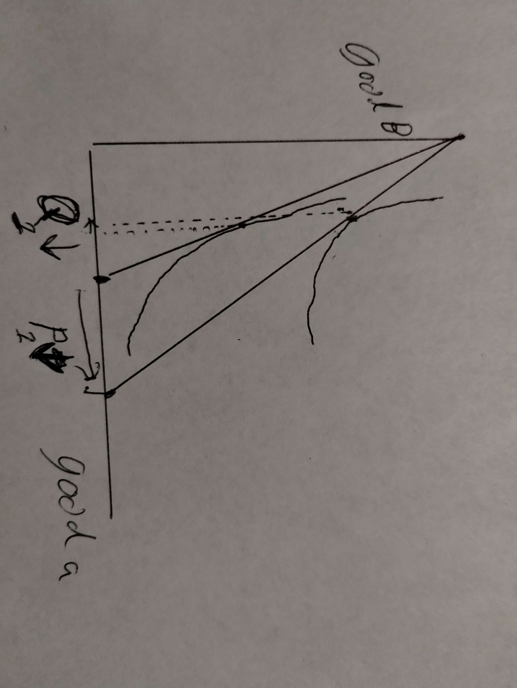

# Question 1

```{r, echo=FALSE, eval=TRUE, message=FALSE}
library(tidyverse)
library(latex2exp)
theme_set(theme_bw())

frthrt <- \(x) exp(log(abs(x))/4)
```

```{r, echo=FALSE, eval=TRUE}
Bf1A <- \(x2) (1000-40*x2)/20
```

```{r, echo=FALSE, eval=TRUE}
Bf2A <- \(x1) (1000-20*x1)/40
```

```{r, echo=FALSE, eval=TRUE}
Bf1B <- \(x2) (1000-20*x2)/20
```

```{r, echo=FALSE, eval=TRUE}
Bf2B <- \(x1) (1000-20*x1)/20
```

```{r, echo=FALSE, eval=TRUE}
Bf1C <- \(x2) (1000-10*x2)/20
```

```{r, echo=FALSE, eval=TRUE}
Bf2C <- \(x1) (1000-20*x1)/10
```

```{r, echo=FALSE, eval=TRUE}
ICf1 <- \(x1) 625/(2*x1)
```
```{r, echo=FALSE, eval=TRUE}
ICf2 <- \(x1) 625/x1
```
```{r, echo=FALSE, eval=TRUE}
ICf3 <- \(x1) 1250/x1
```

```{r, echo=FALSE, eval=TRUE, warning=FALSE, fig.cap="consumer optimization for two goods."}
data.frame(x=c(0,Bf2A(0),12.5,0,Bf2B(0),25,0,Bf2C(0),50)) |>
  mutate(y=c(Bf1A(c(0,Bf2A(0),12.5)),Bf1B(c(0,Bf2B(0),25)),Bf1C(c(0,Bf2C(0),50)))) |>
  mutate(label=sprintf("(%s,%s)", x, y)) |>
  ggplot(aes(x=x, y=y, label=label)) +
  stat_function(fun=Bf1A) +
  stat_function(fun=Bf1B) +
  stat_function(fun=Bf1C) +
  stat_function(fun=ICf1) +
  stat_function(fun=ICf2) +
  stat_function(fun=ICf3) +
  geom_point() +
  geom_hline(yintercept = 0) +
  geom_vline(xintercept = 0) +
  xlab("Good 1") +
  ylab("Good 2") +
  annotate("text", x=Bf2A(0)/2, y=Bf1A(Bf2A(0)*9/10), label=TeX("$p_1=\\$40$")) +
  annotate("text", x=Bf2B(0)/1.4, y=Bf1B(Bf2B(0)*9/10), label=TeX("$p_1=\\$20$")) +
  annotate("text", x=Bf2C(0)/1.25, y=Bf1C(Bf2C(0)*9/10), label=TeX("$p_1=\\$10$")) +
  annotate("text", x=7, y=Bf1A(12.5)-2, label=TeX("$bundle_A$")) +
  annotate("text", x=33, y=Bf1B(25), label=TeX("$bundle_B$")) +
  annotate("text", x=57, y=Bf1C(50)+2, label=TeX("$bundle_C$")) +
  theme(axis.text=element_blank(), axis.ticks=element_blank()) +
  scale_x_continuous(limits = c(0, 125)) +
  scale_y_continuous(limits = c(0, 75))
```

$$
bundle_A =
\left[
\begin{array}{c}
12.5 \\
25
\end{array}
\right]
$$

$$
bundle_B =
\left[
\begin{array}{c}
25 \\
25
\end{array}
\right]
$$

$$
bundle_C =
\left[
\begin{array}{c}
50 \\
25
\end{array}
\right]
$$


\newpage

```{r, echo=FALSE, eval=TRUE}
DC <- \(p1) 500/p1
```

```{r, echo=FALSE, eval=TRUE, warning=FALSE, fig.cap="moving along demand curve."}
data.frame(y=c(10,20,40)) |>
  mutate(x=DC(y)) |>
  mutate(label=sprintf("(%s,%s)", x, y)) |>
  ggplot(aes(x=x, y=y, label=label)) +
  stat_function(fun=DC) +
  geom_point() +
  geom_hline(yintercept = 0) +
  geom_vline(xintercept = 0) +
  xlab("Quantity of Good 1") +
  ylab("Price of Good 1") +
  annotate("text", y=10+2.5, x=DC(10)+14.5, label=TeX("$P_1=\\$10 \\wedge Q_1=50$")) +
  annotate("text", y=20+2.5, x=DC(20)+15, label=TeX("$P_1=\\$20 \\wedge Q_1=25$")) +
  annotate("text", y=40+2.5, x=DC(40)+16, label=TeX("$P_1=\\$40 \\wedge Q_1=12.5$")) +
  theme(axis.text=element_blank(), axis.ticks=element_blank()) +
  scale_x_continuous(limits = c(0, 125)) +
  scale_y_continuous(limits = c(0, 75))
```


\newpage

# Question 2

```{r, echo=FALSE, eval=TRUE}
Bf1A <- \(x2) (1000-20*x2)/20
```

```{r, echo=FALSE, eval=TRUE}
Bf2A <- \(x1) (1000-20*x1)/20
```

```{r, echo=FALSE, eval=TRUE}
Bf1B <- \(x2) (1200-20*x2)/20
```

```{r, echo=FALSE, eval=TRUE}
Bf2B <- \(x1) (1200-20*x1)/20
```

```{r, echo=FALSE, eval=TRUE}
Bf1C <- \(x2) (1500-20*x2)/20
```

```{r, echo=FALSE, eval=TRUE}
Bf2C <- \(x1) (1500-20*x1)/20
```

```{r, echo=FALSE, eval=TRUE}
ICf1 <- \(x1) 625/x1
```
```{r, echo=FALSE, eval=TRUE}
ICf2 <- \(x1) 900/x1
```
```{r, echo=FALSE, eval=TRUE}
ICf3 <- \(x1) 5625/(4*x1)
```

```{r, echo=FALSE, eval=TRUE, warning=FALSE, fig.cap="consumer optimization for two goods."}
data.frame(x=c(0,Bf2A(0),25,0,Bf2B(0),30,0,Bf2C(0),37.5)) |>
  mutate(y=c(Bf1A(c(0,Bf2A(0),25)),Bf1B(c(0,Bf2B(0),30)),Bf1C(c(0,Bf2C(0),37.5)))) |>
  mutate(label=sprintf("(%s,%s)", x, y)) |>
  ggplot(aes(x=x, y=y, label=label)) +
  stat_function(fun=Bf1A) +
  stat_function(fun=Bf1B) +
  stat_function(fun=Bf1C) +
  stat_function(fun=ICf1) +
  stat_function(fun=ICf2) +
  stat_function(fun=ICf3) +
  geom_point() +
  geom_hline(yintercept = 0) +
  geom_vline(xintercept = 0) +
  xlab("Good 1") +
  ylab("Good 2") +
  annotate("text", x=Bf2A(0)-10, y=Bf1A(Bf2A(0))+4, label=TeX("$Y=\\$1000$")) +
  annotate("text", x=Bf2B(0), y=Bf1B(Bf2B(0))+6, label=TeX("$Y=\\$1200$")) +
  annotate("text", x=Bf2C(0)-8, y=Bf1C(Bf2C(0))+2, label=TeX("$Y=\\$1500$")) +
  annotate("text", x=25-7, y=Bf1A(25)-2, label=TeX("$bundle_A$")) +
  annotate("text", x=30+8, y=Bf1B(30), label=TeX("$bundle_B$")) +
  annotate("text", x=37.5+8, y=Bf1C(37.5)+2, label=TeX("$bundle_C$")) +
  theme(axis.text=element_blank(), axis.ticks=element_blank()) +
  scale_x_continuous(limits = c(0, 75)) +
  scale_y_continuous(limits = c(0, 75))
```

$$
bundle_A =
\left[
\begin{array}{c}
25 \\
25
\end{array}
\right]
$$

$$
bundle_B =
\left[
\begin{array}{c}
30 \\
30
\end{array}
\right]
$$

$$
bundle_C =
\left[
\begin{array}{c}
37.5 \\
37.5
\end{array}
\right]
$$

```{r, echo=FALSE, eval=TRUE}
DC1 <- \(p1) 500/p1
```

```{r, echo=FALSE, eval=TRUE}
DC2 <- \(p1) 600/p1
```

```{r, echo=FALSE, eval=TRUE}
DC3 <- \(p1) 750/p1
```

```{r, echo=FALSE, eval=TRUE, warning=FALSE, fig.cap="demand shifting."}
data.frame(y=c(20,20,20)) |>
  mutate(x=c(DC1(20),DC2(20),DC3(20))) |>
  mutate(label=sprintf("(%s,%s)", x, y)) |>
  ggplot(aes(x=x, y=y, label=label)) +
  stat_function(fun=DC1) +
  stat_function(fun=DC2) +
  stat_function(fun=DC3) +
  geom_point() +
  geom_hline(yintercept = 0) +
  geom_vline(xintercept = 0) +
  xlab("Quantity of Good 1") +
  ylab("Price of Good 1") +
  annotate("text", y=20+0.5, x=DC1(20)-3, label=TeX("$P_1=\\$20 \\wedge$")) +
  annotate("text", y=20-0.5, x=DC1(20)-2, label=TeX("$Q_1=25$")) +
  annotate("text", y=20-0.5, x=DC2(20)-1.8, label=TeX("$Q_1=30$")) +
  annotate("text", y=20-0.5, x=DC3(20)-2, label=TeX("$Q_1=37.5$")) +
  theme(axis.text=element_blank(), axis.ticks=element_blank()) +
  scale_x_continuous(limits = c(20, 50)) +
  scale_y_continuous(limits = c(10, 30))
```


\newpage

# Question 3

```{r, echo=FALSE, eval=TRUE}
Bf1B <- \(x2) (1000-20*x2)/20
```

```{r, echo=FALSE, eval=TRUE}
Bf2B <- \(x1) (1000-20*x1)/20
```

```{r, echo=FALSE, eval=TRUE}
Bf1C <- \(x2) (1000-10*x2)/20
```

```{r, echo=FALSE, eval=TRUE}
Bf2C <- \(x1) (1000-20*x1)/10
```

```{r, echo=FALSE, eval=TRUE}
Bf1D <- \(x2) (1000-10*x2)/20-12.5-2.15
```

```{r, echo=FALSE, eval=TRUE}
Bf2D <- \(x1) 70.7 - 2 * x1
```

```{r, echo=FALSE, eval=TRUE}
ICf2 <- \(x1) 625/x1
```
```{r, echo=FALSE, eval=TRUE}
ICf3 <- \(x1) 1250/x1
```

```{r, echo=FALSE, eval=TRUE, warning=FALSE, fig.cap="substitution effect vs income effect."}
data.frame(x=c(0,Bf2B(0),25,0,Bf2C(0),50,0,Bf2D(0),37)) |>
  mutate(y=c(Bf1B(c(0,Bf2B(0),25)),Bf1C(c(0,Bf2C(0),50)),Bf1D(c(0,Bf2D(0),37)))) |>
  mutate(label=sprintf("(%s,%s)", x, y)) |>
  ggplot(aes(x=x, y=y, label=label)) +
  stat_function(fun=Bf1B) +
  stat_function(fun=Bf1C) +
  stat_function(fun=Bf1D) +
  stat_function(fun=ICf2) +
  stat_function(fun=ICf3) +
  geom_point() +
  geom_hline(yintercept = 0) +
  geom_vline(xintercept = 0) +
  geom_vline(xintercept = 25) +
  geom_vline(xintercept = 37) +
  geom_vline(xintercept = 50) +
  geom_segment(aes(x=25,xend=50,y=60,yend=60)) +
  xlab("Good 1") +
  ylab("Good 2") +
  annotate("text", x=(25+37)/2, y=60+3, label="substitution") +
  annotate("text", x=(25+37)/2, y=60-3, label="effect") +
  annotate("text", x=(50+37)/2, y=60+3, label="income") +
  annotate("text", x=(50+37)/2, y=60-3, label="effect") +
  theme(axis.text=element_blank(), axis.ticks=element_blank()) +
  scale_x_continuous(limits = c(0, 75)) +
  scale_y_continuous(limits = c(0, 75))
```

\newpage

# Question 4

```{r, echo=FALSE, eval=TRUE, message=FALSE}
library(tidyverse)
library(latex2exp)
theme_set(theme_bw())
```

A Giffen good: as price decreases, so does quantity. See fig.6.

An example which you gave us was the great potato famine of Ireland.



\newpage

# Question 5

a.

Demand for good 1 is $\frac{Y}{4 p_1}$

Demand for good 2 is $\frac{3 Y}{4 p_2}$

b.

The slope for good 1 is $-\frac{Y}{4 p_1^2}$
The slope for good 2 is $-\frac{3 Y}{4 p_2^2}$

$Y>0$ and $P1,2 > 0$, therefor the slopes are $<0$


