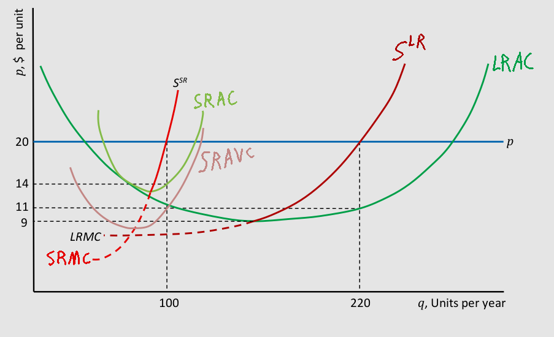

```{r, eval=TRUE, echo=FALSE, message=FALSE, warning=FALSE}
knitr::opts_chunk$set(
  eval=TRUE,
  echo=FALSE,
  message=FALSE,
  warning=FALSE
)

library(tidyverse)
library(latex2exp)
theme_set(theme_bw())
```

### 1.a. What is the residual demand faced by firm *i*?

$$
D^r(p) \doteq D(p) - S^o(p)
$$$$
S^o(p) \doteq (n-1) \cdot S_i(p)
$$$$
{S^o}^* = 24 \cdot (150+1.25p^*)
$$$$
{D^r}^* = 4000 - 2p^* - 24 \cdot (150+1.25p^*)
$$$$
{D^r}^* = 400 - 32p^*
$$$$
S(p) \doteq n \cdot S_i(p) = 3750 + 31.25 p
$$$$
Q^* = 3750 + 31.25 p^* = 4000 - 2p^*
$$$$
\left[\begin{array}{c}
  p^* \\
  Q^*
\end{array} \right] =
\left[\begin{array}{cc}
  -31.25 & 1 \\
  2 & 1
\end{array} \right]^{-1}
\cdot \left[\begin{array}{c}
  3750 \\
  4000
\end{array} \right]
$$$$
\left[\begin{array}{c}
  p^* \\
  Q^*
\end{array} \right] =
\frac{1}{133}\left[\begin{array}{c}
  1000 \\
  530000
\end{array} \right] \approx
\left[\begin{array}{c}
  7.52 \\
  3954.96
\end{array} \right]
$$$$
{D^r}^* \approx 400 - 32 \cdot 7.52
$$$$
{D^r}^* \approx 159.4
$$

### 1.b. Find the inverse residual demand curve for firm *i* and the inverse market demand curve.

See 1.a.$$
{D^r}(p) = 400 - 32p \Rightarrow {D^r_{inv}}(Q) = \frac{25}{2} - \frac{Q}{32}
$$$$
D(p) = 4000 - 2p \Rightarrow D_{inv}(Q) = 2000 - \frac{Q}{2}
$$

### 1.c. Draw the inverse residual demand curve for firm *i* and the inverse market demand curve. Show that the (inverse) residual demand curve for firm *i* is flatter than the (inverse) market demand curve. Residual demand is almost horizontal but the market demand curve is steeper.

```{r}
D <- \(p) 4000 - 2*p
Dinv <- \(Q) 2000 - Q/2
Dr <- \(p) 400 - 32*p
Drinv <- \(Q) 25/2 - Q/32
```

```{r}
data.frame(x=c(0,Dr(0),0,Dr(0))) |>
  mutate(y=c(Dinv(c(0,Dr(0))),Drinv(c(0,Dr(0))))) |>
  mutate(label=sprintf("(%s,%s)", x, y)) |>
  ggplot(aes(x=x, y=y, label=label)) +
  stat_function(fun=Dinv) +
  stat_function(fun=Drinv) +
  xlab("Q") +
  ylab("p") +
  annotate("text", x=200, y=200, label=TeX("$D^r$")) +
  annotate("text", x=200, y=1750, label=TeX("$D$"))
```

### 2. if $p=\$120$, $AVC = \$(40+10q)$, and $FC = \$100$, what is the $SR$ profit-maximizing level of output, $q^*$? What is the total profit at $q^*$?

$$q^* \Leftarrow \frac{\delta\Pi}{\delta q}=0\text{ solved for }q\text{.}$$
$$
\frac{\delta\Pi}{\delta q} = \frac{\delta R}{\delta q} - \frac{\delta VC}{\delta q} =
\$(120 - 40 - 20q) = \$(80 - 20q)
$$
$$0 = \$(80 - 20q^*) \Rightarrow q^* = 4$$
$$
\Pi^* = p \cdot q^* - TC - VC(q^*) = \$(120 \cdot 4 - 100 - 40 - 20 \cdot 4) = \$360
$$

\newpage

### 3. For each scenario, determine whether the firm should shut down or not.

3.a. In the short run, $R=\$6,000$, $VC=\$7,500$, and $FC=\$12,000$.

Operating: $\$(6,000 - 12,000 - 7,500) = -\$13,500$; Not Operating: $-\$12,000$

The firm should not operate. It should shut down. Losses are greater if they operate.

3.b. In the short run, $p=\$15$, $q^*=30$, $AVC=\$\frac{q}{3}$, and $FC=\$3,000$.

$$R = \$15\cdot30 = \$450$$
$$VC = AVC(q^*) \cdot q^* = \$\frac{30}{3} \cdot 30 = \$300$$

Operating: $\$(450 - 3,000 - 300) = -\$2,850$; Not Operating: $-\$3,000$

The firm should operate. It should not shut down. Losses are greater if they shut down.

3.c. In the long run, $R=\$10,000$, $VC=\$5,500$, and $FC=\$6,000$.

$$\Pi = \$(10,000 - 5,500 - 6,000) = -\$1,500 < 0$$

The firm should shut down, as profit is less than 0.

4.a. Label the plot:



4.b. What is the firm's optimal short-run output?
$$100$$

4.c. How much is the firm's short-run profit?
$$\$14$$

4.d. What is the firm's optimal long-run output?
$$220$$

4.e. How much is the firm's long-run profit?
$$\$11$$

4.f. What is the firm's long-run shit down price?
$$\$9$$